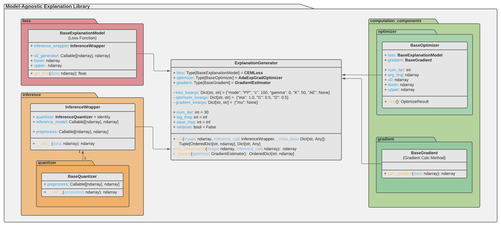

# Model-Agnostic Explanation Library (MAX Lib)

This repository contains a highly-modular, model-agnostic framework for explanation generation. Moreover, you will find an introduction into the library here, which may help you with the explanation of your ML prediction. The introduction will walk you through the essential components of the library and further present to you examples how to extend it. Ultimately, it will guide you through generation of a first explanation with the help of this library.

For developers, it is suggested that you take a look at the Python documentation for more detailed information on the API.

**Currently implemented explanation methods**:

- “[_Explanations based on the Missing: Towards Contrastive Explanations with Pertinent Negatives_](https://arxiv.org/abs/1802.07623)”

## Table of Contents

- [Model-Agnostic Explanation Library (MAX Lib)](#model-agnostic-explanation-library-max-lib)
  - [Table of Contents](#table-of-contents)
  - [Installation](#installation)
  - [Components](#components)
    - [Loss Package (Explanation Models)](#loss-package-explanation-models)
    - [Inference Package](#inference-package)
      - [Inference Quantizer](#inference-quantizer)
      - [Inference Wrapper](#inference-wrapper)
    - [Computation Components Package](#computation-components-package)
      - [Optimizer](#optimizer)
      - [Gradient (Calculation Method)](#gradient-calculation-method)
    - [Explanation Generator](#explanation-generator)
  - [API Documentation](#api-documentation)
  - [Tutorials](#tutorials)
    - [General Tutorials](#general-tutorials)
    - [Computation Component Tutorials](#computation-component-tutorials)
    - [Inference Component Tutorials](#inference-component-tutorials)
    - [Explanation Model Tutorials](#explanation-model-tutorials)

## Installation

**Prerequisites**

For installation, it is necessary to have the package manager _Poetry_ and _Python 3.8_ installed.

**Package Installation**

1. Navigate to the desired destination directory.
2. Clone the repository:

```bash
git clone https://gitlab.dai-labor.de/empaia/constrastive-explaination-prototype.git
```

3. Now, either install the package in an exclusive python environment:

```bash
cd constrastive-explaination-prototype
poetry install
```

4. Or install the package within another Poetry environment:

```bash
cd *LOCATION_OF_YOUR_PACKAGE*
poetry add --editable *PATH_TO_MAX_LIB*
```

## Components

This section covers the main components of this library. Each component takes an integral part in the explanation generation.
Below, an overview of the components is displayed:


For every entity, there exists a base class that has to be inhereted from. That makes the implementation of custom components a little simpler as the API is described in detail in those abstract classes. Furthermore, the API will automatically be imposed by Python.

### Loss Package (Explanation Models)

[API](https://tuananhroman.github.io/empaia_max_pydoc/lib/loss/base_explanation_model.html)

- Modules in this subpackage implement target function of the optimization, as we formulate the explanation as an optimization problem
- Measurement of the cost
- Formalizes the model-agnostic explanation method
- Incorporates external inference model - is called for its calculations

Currently implemented:

- [Contrastive-Explanation-Method (PP and PN)](https://arxiv.org/abs/1802.07623)

### Inference Package

- Inference methods need to return array with classification probabilities in order for the loss function to incorporate the prediction into its calculations
- If that is currently not the case, consider implementing a custom _Inference Quantizer_
- This subpackage consists of modules which help you transform an arbitrary predicition result to the required format
- One can disregard this package, when no pre-inference processing is required and when the prediction is already in a method-conforming format

#### Inference Quantizer

[API](https://tuananhroman.github.io/empaia_max_pydoc/lib/inference/quantizer/base_quantizer.html)

- The BaseQuantizer translates the produced prediction into a explanation method compatible format
- Here, the inference result is required to be of the typical classification problems format - each entry of the array indicates a likeliness of a class being present in the image
- Input could be any type of model prediction e.g. a segmentation mask
- A valid output would be e.g. `array([0.1, 2.3, -4.1])`

#### Inference Wrapper

[API](https://tuananhroman.github.io/empaia_max_pydoc/lib/inference/inference_wrapper.html)

- This class offers you the option to implement a preprocessing (pre-inference) procedure
- Furthermore, it stores the external inference method and can subsequently apply the _Inference Quantizer_
- Given an image, the procedures are called in the following order: preprocessing -> inference -> quantizer
- Each operation, again, is optional. When left out, the identity function is used.


### Computation Components Package

This package contains the necessary engines to solve the optimization problems. In other words, it contains the optimizer algorithms and gradient calculation methods. Like for the loss functions, we provide a base class for both the optimizers and gradient methods in order for easy extension of the library.

#### Optimizer

[API](https://tuananhroman.github.io/empaia_max_pydoc/lib/computation_components/optimizer/base_optimizer.html)

Currently implemented:

- Adaptive Exponentiated Gradient
- Adaptive Optimistic Exponentiated Gradient

#### Gradient (Calculation Method)

[API](https://tuananhroman.github.io/empaia_max_pydoc/lib/computation_components/gradient/base_gradient.html)

Currently implemented:

- Gradient Estimation
- TensorFlow-based Gradient Calculation

### Explanation Generator

[API](https://tuananhroman.github.io/empaia_max_pydoc/lib/explanation/explanation_generator.html)

The Explanation Generator interconnects all the above mentioned components and in that way enables the optimization procedure with respect to the defined explanation model.

## API Documentation



## Tutorials

### General Tutorials

- [Minimal Effort Example with CEM on MNIST](docs/md/tutorials/minimal_effort_mnist.md)

  - [Extension: Example `AsyncExplanationWrapper` Usage](docs/md/tutorials/async_explanation_example.md)

- [CEM PP/PN-Smooth Demonstration](docs/md/tutorials/cem_pp_pn_smooth_example.md)
- [l1-, l2- and kappa- Influence on Explanations](./docs/md/tutorials/l1_l2_kappa_influence.md)
- [Introduction & Tutorial to the `SegmentationHandler`](experiments/notebooks/intro_tut_segmentationhandler.ipynb)

### Computation Component Tutorials

- [`Optimizer` Implementation](docs/md/tutorials/optimizer_example.md)

- [`Gradient Calculation Method` Implementation](docs/md/tutorials/gradient_example.md)

### Inference Component Tutorials

- [`Quantizer` Implementation](docs/md/tutorials/quantizer_example.md)

- [`Inference Wrapper` Usage](docs/md/tutorials/inference_wrapper_example.md)

### Explanation Model Tutorials

- [`Explanation Model` (_Loss Function_) Implementation](docs/md/tutorials/explanation_model_example.md)

<!--  -->

This open source project is funded by the German Federal Ministry for Economic Affairs and Climate Action as part of the [EMPAIA project](https://www.empaia.org) under Grant Agreement No. 01MK20002C.
