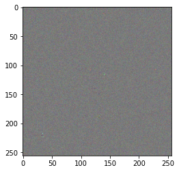

# [CEM] Smooth Pertinent Positive and Pertinent Negative Demonstration on "Clinically Guided Soft Attention for AI-Assistance in Histopathology"

In order to have one less hyperparameter to tune within CEM, we decided to introduce the smooth version of PP and PN. Kappa is replaced by this mathmatical expression:

```python
f_K=attack_value+np.log(1.0+np.exp(-attack_value))
```

For this tutorial, we will walk through the code and apply this new version of PP and PN in an histopathologic domain. Eventually, we will take a look at the generated explanations and conclude.

The model, weights and images can be found here:
https://gitlab.dai-labor.de/empaia/guided-soft-attention/-/tree/master

**Consider we have this histopathologic image**:


## Code Implementation

1. **Import the required libraries**:

```python
import sys

sys.path.insert(1, PATH_TO_GUIDED_SOFT_ATTENTION)

import torch
from PIL import Image
from IPython.display import display
from matplotlib import pyplot as plt

import maxi
from src.models.vit_gusa import ViTGuSA
from utils.loader import Loader
from utils.transform import transform
from src.visualization.visualize_attention import visualize_attention
```

2. **Load the model and medical image**:

```python
dev = "cuda" if torch.cuda.is_available() else "cpu"
device = torch.device(dev)

model = ViTGuSA(4, dev, patch_size=8, freeze_backbone=True, head_depth=1)

model.load_state_dict(
    torch.load(
        PATH_TO_MODEL_WEIGHTS,
        map_location=device,
    )
),

img = Image.open(
    PATH_TO_IMAGE   # image_8 was utilized
)

img_transformed = transform(
    img, img_size=(img.size[0] // 4, img.size[1] // 4), patch_size=8
).unsqueeze(0)

img_transformed = img_transformed.to(device)
model.to(device)

```

3. **Chose your desired component classes for the optimization (loss, optimizer and gradient). Then, specify the configuration of the components**:

In the loss_kwargs dictionary one is required to specify the explanation mode. For **CEM** it can be one of the following: `PP`, `PN`, `PPSMOOTH`, `PNSMOOTH`.
For the smooth version of PP, specify `PPSMOOTH`, otherwise `PNSMOOTH` for PN-Smooth.

```python
loss_class = maxi.loss.Torch_CEMLoss
optimizer_class = maxi.optimizer.AdaExpGradOptimizer
gradient_class = maxi.gradient.Torch_Gradient

# specify the configuration for the components
loss_kwargs = {"mode": "PPSMOOTH", "gamma": 1, "K": 2}
optimizer_kwargs = {
    "l1": 2.0,
    "l2": 2.0,
    "eta": 1,
    "channels_first": True,
}
gradient_kwargs = {}
```

4. **Instantiate the `ExplanationGenerator` with our custom configuration**:

```python
cem = maxi.ExplanationGenerator(
    loss=loss_class,
    optimizer=optimizer_class,
    gradient=gradient_class,
    loss_kwargs=loss_kwargs,
    optimizer_kwargs=optimizer_kwargs,
    gradient_kwargs=gradient_kwargs,
    num_iter=200,
    save_freq=100,
    verbose=True,
)
```

5. **Instantiate InferenceWrapper with neccessary processing procedures**:

```python

# cast image to torch.float32 and to the correct device before inference
def preprocess(data):
    if type(data) is not torch.Tensor or data.dtype != torch.float32:
        return torch.tensor(data, dtype=torch.float32, device=device)
    if data.device != device:
        data = data.to(device)
    return data

# unsqueeze prediction to match the batch dimension
def un_squeeze(data):
    return data[0].unsqueeze(0) if data[0].ndim < 2 else data[0]

# wrap the model with the preprocess and un_squeeze functions
_model = maxi.inference.InferenceWrapper(
    model, quantizer=un_squeeze, preprocess=preprocess
)

```

6. **Start the explanation procedure and retrieve the results**:

```python
results, _ = cem.run(image=img_transformed.cpu().numpy(), inference_call=_model)

# save the results
for _iter, res in results.items():
    np.save(f"cem_attention_{_iter}.npy", res)
```

Note: The first return value is a OrderedDictionary that contains the savepoints keyed by the number of the respective iteration. The second return value would be a dictionary containing the images' meta data, which can be optionally parsed to the `maxi.ExplanationGenerator.run()` method. This is epescially useful when using the `maxi.AsyncExplanationWrapper` as it makes it simpler to distinguish between the different explanation results given the meta data.

## Explanations

#### PP-Smooth

Below you can observe the pertinent positive as generated by PP-Smooth. It can be assumed that the model prioritized the cell boundaries for its prediction.


#### PN-Smooth

##### Pertinent Negative

Below depicted is the pertinent negative as generated by PN-Smooth. In general, the explanation seems quite noisy. Further, it can be highlighted that there are two specific pixels standing out meaning that manipulating those two pixels would be sufficient to change the prediction.



##### Pertinent Negative + Original Image

Below, the pertinent negative added to the original histopathologic image is shown.


For an human expert, it is almost impossible to distinguish the original image with the perturbed one. Still, the prediction scores quite differ as can be seen below:

Prediction scores of the original image:
`tensor([-0.0769, 5.8685, -4.5399, -1.9916])`

Prediction scores of the original image + pertinent negative:
`tensor([-4.4830, 3.8907, -4.8994, 4.2906])`

One can conclude that the model is not robust and thus prone to adverserial attacks.
