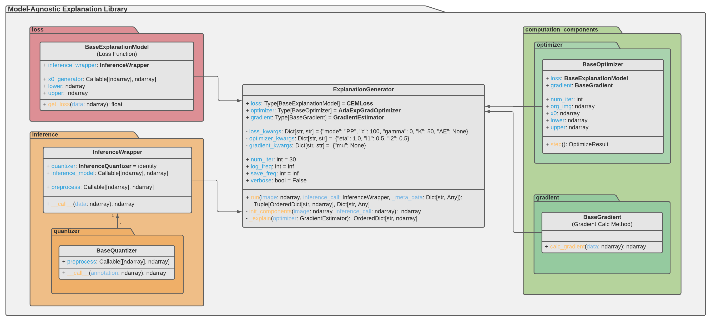

# Example: Gradient Method Implementation



In this tutorial, we will present an example of how one would implement a custom gradient calculation module into the MAX library. The gradient calculation plays an integral part in the optimization process and thus in the explanation generation procedure.

**Note that it is explicitly recommended to inheret from the provided base class `BaseGradient` in order to comply with our API!**

[BaseGradient Documentation](https://tuananhroman.github.io/empaia_max_pydoc/lib/computation_components/gradient/base_gradient.html)

Suppose we would like to implment the _Uniform Random Vector-based Gradient Estimation_ method in order to estimate the gradient during explanation generation. As the python documentation shows, the resulting class requires and `BaseExplanationModel` instance to be parsed for initialization - since it poses as the loss function from which we will compute the gradient with. Furthermore, the object has to implement the `__call__` method which returns a gradient given some image.

Ultimately, we arrive at the following implementation:

```python
from .base_gradient import BaseGradient


class URVGradientEstimator(BaseGradient):
    def __init__(
        self,
        loss: Callable[[np.ndarray], float],
        img_size: int,
        mu: float = None,
        num_iter: int = 100,
    ) -> None:
        """Uniform Random Vector-based Gradient Estimation

        Args:
            loss (Callable[[np.ndarray], float]): Explanation method's specific class instance (loss function).
            img_size (int): Number of entries in the matrix. In numpy: ``array.size``.
            mu (float, optional): Variance of the normal distribution. Defaults to None.
            num_iter (int, optional): Number of estimation steps. Defaults to 100.
        """
        super().__init__(loss=loss)

        self.t, self.d, self.q = 0, img_size, num_iter
        self.mu = mu

        self.randomState = np.random.RandomState()

    def __call__(self, data: np.ndarray) -> np.ndarray:
        """Method for estimating the gradient

        Args:
            data (np.ndarray): Perturbation matrix in [width, height, channels].

        Returns:
            np.ndarray: Matrix containing the computed gradient of shape [width, height, channels].
        """
        self.t += 1.0

        mu = 1.0 / np.sqrt(self.t) / np.sqrt(self.d) if self.mu is None else self.mu
        tilde_f_x_r = self.loss.get_loss(data)

        g = np.zeros(data.shape)
        for _ in range(self.q):
            u = self.randomState.normal(size=data.shape)
            u_norm = np.linalg.norm(u)
            u = u / u_norm
            tilde_f_x_l = self.loss.get_loss(data + mu * u)
            g += self.d / mu / self.q * (tilde_f_x_l - tilde_f_x_r) * u
        return g

```

Essentially, the user must provide the arguments `img_size`, `mu`, `num_iter` with the keyword `gradient_kwargs` as arguments when initializing the `ExplanationGenerator` as can be seen below:

```python
    # chose desired component classes for the loss, optimizer and gradient
    # set our 'Uniform Random Vector-based Gradient Estimation' as gradient method
    loss_class = maxi.TF_CEMLoss
    optimizer_class = maxi.AoExpGradOptimizer
    gradient_class = maxi.URVGradientEstimator

    # specify the configuration for the components
    loss_kwargs = {"mode": "PP", "c": 100, "gamma": 300, "K": 30, "AE": AE}
    optimizer_kwargs = {"l1": 0.1, "l2": 30, "eta": 1.0}
    gradient_kwargs = {"mu": None, "num_iter": 150}

    # instantiate the "ExplanationGenerator" with our settings
    cem = maxi.ExplanationGenerator(
        loss=loss_class,
        optimizer=optimizer_class,
        gradient=gradient_class,
        loss_kwargs=loss_kwargs,
        optimizer_kwargs=optimizer_kwargs,
        gradient_kwargs=gradient_kwargs,
        num_iter=1500,
        save_freq=500,
    )
```

[Back to main page](../../../README.md)
