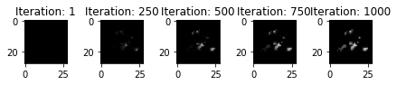

# `l1`, `l2` & (CEM)`kappa` Influence on the Explanation Generation

For the provided optimizers, it might is essential to chose the right combination of hyperparameters - namely `l1`, `l2` and `kappa`. As you will see in this tutorial, the configuration of the latters heavily influences the result that is generated.

## Experiment Setup

```python
loss_class = maxi.loss.TF_CEMLoss
optimizer_class = maxi.optimizer.AdaExpGradOptimizer
gradient_class = maxi.gradient.TF_Gradient

loss_kwargs = {"mode": "PP", "c": 1, "gamma": 3, "K": 2}
optimizer_kwargs = {
    "l1": 0.05,
    "l2": 0.005,
    "channels_first": False,
}
gradient_kwargs = {"mu": None}
```

## kappa Influence

### Kappa = 2


### Kappa = 10


### Kappa = 20


## l1 Influence

### l1 = 0.000005



### l1 = 0.005


### l1 = 5.0


## l2 Influence

### l2 = 0.0000005


### l1 = 0.005


### l1 = 5.0


